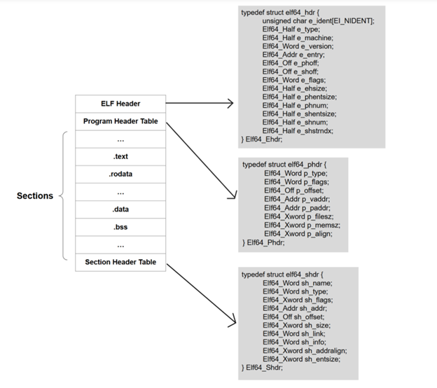
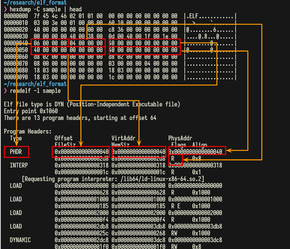
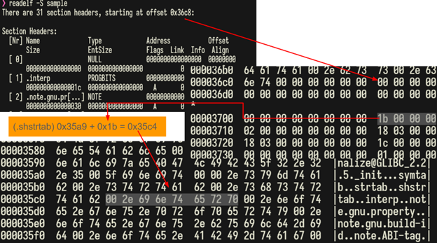
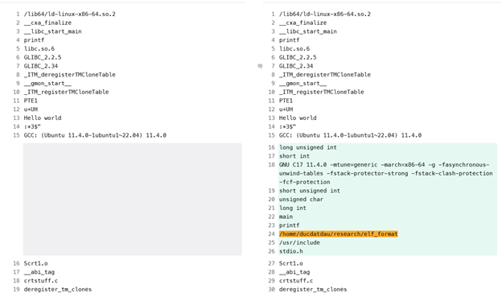
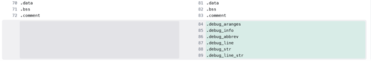

# Basic of ELF file 

## Phần 1. Nghiên cứu cấu trúc file ELF

ELF (Executable and Linkable Format) là một định dạng file tiêu chuẩn được sử dụng rộng rãi trong các hệ điều hành UNIX-like như Linux, FreeBSD, v.v. Cấu trúc ELF bao gồm ba phần chính:
1. ELF Header
2. Program Header Table
3. Section Header Table



### ELF Header: The File’s Metadata

ELF Header là phần đầu tiên của một file ELF. Mục đích của nó là cung cấp metadata cho hệ điều hành để hiểu quá trình tạo file. Với file ELF 64 bit, ELF header có kích thước 64 bytes và được định nghĩa như sau: 

```c
/* 64-bit ELF base types. */
typedef __u64 Elf64_Addr;       /* 8 byte (unsigned) */
typedef __u16 Elf64_Half;       /* 2 byte (unsigned) */
typedef __s16 Elf64_SHalf;      /* 8 byte (signed) */
typedef __u64 Elf64_Off;        /* 8 byte (unsigned) */
typedef __s32 Elf64_Sword;      /* 4 byte (signed) */
typedef __u32 Elf64_Word;       /* 4 byte (signed) */
typedef __u64 Elf64_Xword;      /* 8 byte (unsigned) */
typedef __s64 Elf64_Sxword;     /* 8 byte (signed) */

[...]
#define EI_NIDENT 16

typedef struct elf64_hdr {
  unsigned char e_ident[EI_NIDENT]; /* ELF "magic number" */
  Elf64_Half e_type;                /* Object file type */
  Elf64_Half e_machine;             /* Architecture */
  Elf64_Word e_version;             /* Object file version */
  Elf64_Addr e_entry;               /* Entry point virtual address */
  Elf64_Off e_phoff;                /* Program header table file offset */
  Elf64_Off e_shoff;                /* Section header table file offset */
  Elf64_Word e_flags;               /* Processor-specific flags */
  Elf64_Half e_ehsize;              /* ELF header size in bytes */
  Elf64_Half e_phentsize;           /* Program header table entry size */
  Elf64_Half e_phnum;               /* Program header table entry count */
  Elf64_Half e_shentsize;           /* Section header table entry size */
  Elf64_Half e_shnum;               /* Section header table entry count */
  Elf64_Half e_shstrndx;            /* Section header string table index */
} Elf64_Ehdr;

[...]
```

### Program Header Table: Runtime Segments 

Program Header Table rất quan trọng trong quá trình thực hiện chương trình. Nó sẽ giúp loader xác định được phần nào của file được tải vào bộ nhớ và cách thức tải sẽ như thế nào. Program Header Table được định nghĩa như sau

```c
[...]
typedef struct elf64_phdr {
  Elf64_Word p_type;        /* Segment type */
  Elf64_Word p_flags;       /* Segment flags */
  Elf64_Off p_offset;       /* Segment file offset */
  Elf64_Addr p_vaddr;       /* Segment virtual address */
  Elf64_Addr p_paddr;       /* Segment physical address */
  Elf64_Xword p_filesz;     /* Segment size in file */
  Elf64_Xword p_memsz;      /* Segment size in memory */
  Elf64_Xword p_align;      /* Segment alignment, file & memory */
} Elf64_Phdr;
[...]
```

### Section Header Table: Linking and Debugging Information

Section Header Table thường được dùng trong linking và debugging. Nó chứa các mô tả các section của file như:
- .text: Mã thực thi.
- .data: Dữ liệu khởi tạo.
- .bss: Dữ liệu chưa khởi tạo.
- .rodata: Dữ liệu chỉ đọc.

```c
[...]
typedef struct elf64_shdr {
  Elf64_Word sh_name;       /* Section name, index in string table */
  Elf64_Word sh_type;       /* Type of section */
  Elf64_Xword sh_flags;     /* Miscellaneous section attributes */
  Elf64_Addr sh_addr;       /* Section virtual addr at execution */
  Elf64_Off sh_offset;      /* Section file offset */
  Elf64_Xword sh_size;      /* Size of section in bytes */
  Elf64_Word sh_link;       /* Index of another section */
  Elf64_Word sh_info;       /* Additional section information */
  Elf64_Xword sh_addralign; /* Section alignment */
  Elf64_Xword sh_entsize;   /* Entry size if section holds table */
} Elf64_Shdr;
[...]
```

## Phần 2. Dịch ngược và phân tích file ELF

Xét ví dụ sau đây 
```c
#include <stdio.h>

int x; 
int y = 1; 

int main() {
    int z = 2; 
    printf("Hello world");
    return 0;
}
```

Compile source code trên và sử dụng một số công cụ để phân tích các header quan trọng. 

### Phân tích ELF Header 

Để phân tích ELF Header, chúng ta sử dụng readelf với option `-h`

```shell
❯ readelf -h sample
ELF Header:
  Magic:   7f 45 4c 46 02 01 01 00 00 00 00 00 00 00 00 00
  Class:                             ELF64
  Data:                              2''s complement, little endian
  Version:                           1 (current)
  OS/ABI:                            UNIX - System V
  ABI Version:                       0
  Type:                              DYN (Position-Independent Executable file)
  Machine:                           Advanced Micro Devices X86-64
  Version:                           0x1
  Entry point address:               0x1060
  Start of program headers:          64 (bytes into file)
  Start of section headers:          14024 (bytes into file)
  Flags:                             0x0
  Size of this header:               64 (bytes)
  Size of program headers:           56 (bytes)
  Number of program headers:         13
  Size of section headers:           64 (bytes)
  Number of section headers:         31
  Section header string table index: 30
```

### Phân tích Program Header Table

Sử dụng công cụ readelf, ta thấy binary có tổng cộng 13 program headers. 

```shell
❯ readelf -l sample

Elf file type is DYN (Position-Independent Executable file)
Entry point 0x1060
There are 13 program headers, starting at offset 64

Program Headers:
  Type           Offset             VirtAddr           PhysAddr
                 FileSiz            MemSiz              Flags  Align
  PHDR           0x0000000000000040 0x0000000000000040 0x0000000000000040
                 0x00000000000002d8 0x00000000000002d8  R      0x8
  INTERP         0x0000000000000318 0x0000000000000318 0x0000000000000318
                 0x000000000000001c 0x000000000000001c  R      0x1
      [Requesting program interpreter: /lib64/ld-linux-x86-64.so.2]
  LOAD           0x0000000000000000 0x0000000000000000 0x0000000000000000
                 0x0000000000000628 0x0000000000000628  R      0x1000
  LOAD           0x0000000000001000 0x0000000000001000 0x0000000000001000
                 0x0000000000000185 0x0000000000000185  R E    0x1000
  LOAD           0x0000000000002000 0x0000000000002000 0x0000000000002000
                 0x00000000000000f4 0x00000000000000f4  R      0x1000
  LOAD           0x0000000000002db8 0x0000000000003db8 0x0000000000003db8
                 0x000000000000025c 0x0000000000000268  RW     0x1000
  DYNAMIC        0x0000000000002dc8 0x0000000000003dc8 0x0000000000003dc8
                 0x00000000000001f0 0x00000000000001f0  RW     0x8
  NOTE           0x0000000000000338 0x0000000000000338 0x0000000000000338
                 0x0000000000000030 0x0000000000000030  R      0x8
  NOTE           0x0000000000000368 0x0000000000000368 0x0000000000000368
                 0x0000000000000044 0x0000000000000044  R      0x4
  GNU_PROPERTY   0x0000000000000338 0x0000000000000338 0x0000000000000338
                 0x0000000000000030 0x0000000000000030  R      0x8
  GNU_EH_FRAME   0x0000000000002010 0x0000000000002010 0x0000000000002010
                 0x0000000000000034 0x0000000000000034  R      0x4
  GNU_STACK      0x0000000000000000 0x0000000000000000 0x0000000000000000
                 0x0000000000000000 0x0000000000000000  RW     0x10
  GNU_RELRO      0x0000000000002db8 0x0000000000003db8 0x0000000000003db8
                 0x0000000000000248 0x0000000000000248  R      0x1

 Section to Segment mapping:
  Segment Sections...
   00
   01     .interp
   02     .interp .note.gnu.property .note.gnu.build-id .note.ABI-tag .gnu.hash .dynsym .dynstr .gnu.version .gnu.version_r .rela.dyn .rela.plt
   03     .init .plt .plt.got .plt.sec .text .fini
   04     .rodata .eh_frame_hdr .eh_frame
   05     .init_array .fini_array .dynamic .got .data .bss
   06     .dynamic
   07     .note.gnu.property
   08     .note.gnu.build-id .note.ABI-tag
   09     .note.gnu.property
   10     .eh_frame_hdr
   11
   12     .init_array .fini_array .dynamic .got
```

Phân tích giá trị từng field của program header đầu tiên .interp sẽ như sau 



- Offset 0x40 - 0x43, p_type = 0x06: Segment chứa cả program header table. 
- Offset 0x44 - 0x47, p_flags = 0x04: Readable segment.
- Offset 0x48 - 0x4f, p_offset = 0x40: Độ lệch của image file. 
- Offset 0x50 - 0x57, p_vaddr = 0x40: Địa chỉ ảo của segment. 
- Offset 0x58 - 0x5f, p_paddr = 0x40: Địa chỉ vật lý  
- Offset 0x60 - 0x67, p_filesz = 0x2D8: Kích thước file image
- Offset 0x68 - 0x6f, p_ memsz = 0x2D8: Kích thước bộ nhớ image

### Phân tích Section Header Table 

Để đọc thông tin về các section, sử dụng câu lệnh readelf với option `-S`

```shell
~/research/elf_format                                                                                                                                                             ❯ readelf -S  sample
There are 31 section headers, starting at offset 0x36c8:

Section Headers:
  [Nr] Name              Type             Address           Offset
       Size              EntSize          Flags  Link  Info  Align
  [ 0]                   NULL             0000000000000000  00000000
       0000000000000000  0000000000000000           0     0     0
  [ 1] .interp           PROGBITS         0000000000000318  00000318
       000000000000001c  0000000000000000   A       0     0     1
  [ 2] .note.gnu.pr[...] NOTE             0000000000000338  00000338
       0000000000000030  0000000000000000   A       0     0     8
  [ 3] .note.gnu.bu[...] NOTE             0000000000000368  00000368
       0000000000000024  0000000000000000   A       0     0     4
  [ 4] .note.ABI-tag     NOTE             000000000000038c  0000038c
       0000000000000020  0000000000000000   A       0     0     4
  [ 5] .gnu.hash         GNU_HASH         00000000000003b0  000003b0
       0000000000000024  0000000000000000   A       6     0     8
  [ 6] .dynsym           DYNSYM           00000000000003d8  000003d8
       00000000000000a8  0000000000000018   A       7     1     8
  [ 7] .dynstr           STRTAB           0000000000000480  00000480
       000000000000008f  0000000000000000   A       0     0     1
  [ 8] .gnu.version      VERSYM           0000000000000510  00000510
       000000000000000e  0000000000000002   A       6     0     2
  [ 9] .gnu.version_r    VERNEED          0000000000000520  00000520
       0000000000000030  0000000000000000   A       7     1     8
  [10] .rela.dyn         RELA             0000000000000550  00000550
       00000000000000c0  0000000000000018   A       6     0     8
  [11] .rela.plt         RELA             0000000000000610  00000610
       0000000000000018  0000000000000018  AI       6    24     8
  [12] .init             PROGBITS         0000000000001000  00001000
       000000000000001b  0000000000000000  AX       0     0     4
  [13] .plt              PROGBITS         0000000000001020  00001020
       0000000000000020  0000000000000010  AX       0     0     16
  [14] .plt.got          PROGBITS         0000000000001040  00001040
       0000000000000010  0000000000000010  AX       0     0     16
  [15] .plt.sec          PROGBITS         0000000000001050  00001050
       0000000000000010  0000000000000010  AX       0     0     16
  [16] .text             PROGBITS         0000000000001060  00001060
       0000000000000117  0000000000000000  AX       0     0     16
  [17] .fini             PROGBITS         0000000000001178  00001178
       000000000000000d  0000000000000000  AX       0     0     4
  [18] .rodata           PROGBITS         0000000000002000  00002000
       0000000000000010  0000000000000000   A       0     0     4
  [19] .eh_frame_hdr     PROGBITS         0000000000002010  00002010
       0000000000000034  0000000000000000   A       0     0     4
  [20] .eh_frame         PROGBITS         0000000000002048  00002048
       00000000000000ac  0000000000000000   A       0     0     8
  [21] .init_array       INIT_ARRAY       0000000000003db8  00002db8
       0000000000000008  0000000000000008  WA       0     0     8
  [22] .fini_array       FINI_ARRAY       0000000000003dc0  00002dc0
       0000000000000008  0000000000000008  WA       0     0     8
  [23] .dynamic          DYNAMIC          0000000000003dc8  00002dc8
       00000000000001f0  0000000000000010  WA       7     0     8
  [24] .got              PROGBITS         0000000000003fb8  00002fb8
       0000000000000048  0000000000000008  WA       0     0     8
  [25] .data             PROGBITS         0000000000004000  00003000
       0000000000000014  0000000000000000  WA       0     0     8
  [26] .bss              NOBITS           0000000000004014  00003014
       000000000000000c  0000000000000000  WA       0     0     4
  [27] .comment          PROGBITS         0000000000000000  00003014
       000000000000002b  0000000000000001  MS       0     0     1
  [28] .symtab           SYMTAB           0000000000000000  00003040
       0000000000000390  0000000000000018          29    18     8
  [29] .strtab           STRTAB           0000000000000000  000033d0
       00000000000001d9  0000000000000000           0     0     1
  [30] .shstrtab         STRTAB           0000000000000000  000035a9
       000000000000011a  0000000000000000           0     0     1
Key to Flags:
  W (write), A (alloc), X (execute), M (merge), S (strings), I (info),
  L (link order), O (extra OS processing required), G (group), T (TLS),
  C (compressed), x (unknown), o (OS specific), E (exclude),
  D (mbind), l (large), p (processor specific)
```

Một số thông tin của Section Header Table được mô tả ở ELF Header đó là: 
- e_shoff: file offset section header table bắt đầu 
- e_shnum: số entry trong section header table
- e_shentsize: kích thước mỗi entry trong section header table

Các bước để tính toán địa chỉ của một section header sẽ như sau:



## Phần 3. Tìm hiểu về thông tin máy build trong file binary 

Nếu compile file binary với các option thông thường, tên máy build sẽ không được lưu trong binary. Ngược lại, nếu compile với option “-g”, thì tên máy build sẽ được lưu lại. Đây là bản so sánh strings diff giữa hai file. 

Tên đường dẫn “/home/ducdatdau/research/elf_format” được lưu lại khi dùng lệnh strings. 

 

Ngoài ra, binary còn có thêm 1 số strings khác liên quan đến việc debug như là: debug_line, debug_str, ...  



Hacker có thể ẩn giấu thông tin máy build bằng cách sử dụng strip với option --strip-all hoặc một số công cụ pack như upx, ps2-packer, elfuck, ...