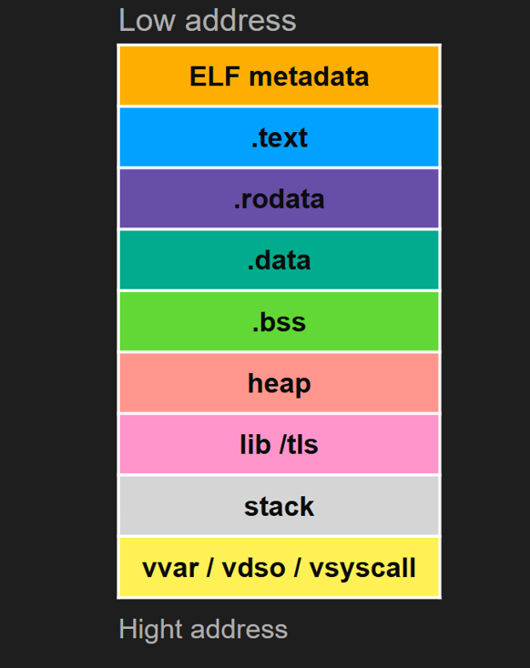
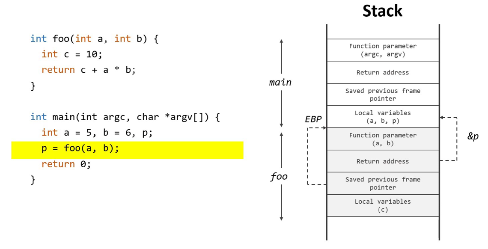
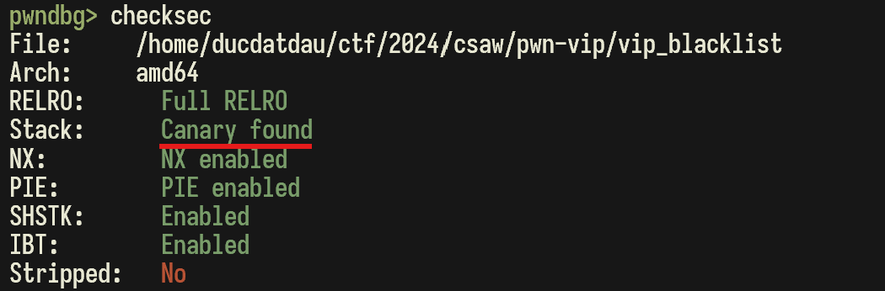
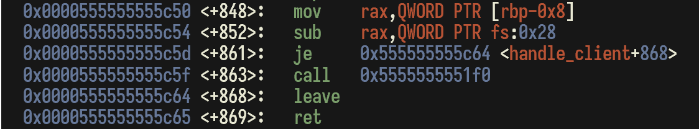

# Linux Memory Layout 

## Giới thiệu

Khi chúng ta viết một chương trình, lấy ví dụ là C/C++, source code sẽ được lưu trong bộ nhớ. Sau đó, khi compile source code, file thực thi vẫn được lưu trong storage. Cuối cùng, khi chạy file thực thi này, nó sẽ được load vào memory và được execute. 

## Linux Memory Layout

Memory layout của một chương trình sẽ gồm những phần sau. Trong đó, ta sẽ quan tâm tới 5 phần chính đó là: Text Segment (.text), Initialized Data Segment (.rodata + .data), Uninitialized Data Segment (.bss), Heap và Stack 



### Text Segment (.text)

Đây là segment nằm ở vùng nhớ có địa chỉ thấp nhất. Nhiệm vụ của nó là chứa các đoạn mã lệnh của chương trình. 

### Initialized Data Segment (.rodata + .data)

Initialized Data Segment là nơi lưu trữ global variables, static variables với điều kiện các biến này được khởi tạo với giá trị khác 0
Lấy ví dụ đoạn mã dưới đây:

```c
int x = 20;

int f() {
    static int y = 10;
    return 0;
}
```

Biến global `x` được gán giá trị 20 và biến static `y` được gán giá trị 10. Chúng đều được khởi tạo với giá trị khác 0, vì vậy chúng sẽ được lưu trong Data Segment. 
Data Segment có thể tiếp tục được chia nhỏ thành: 
-	.rodata: Các biến chỉ đọc, hay còn gọi là hằng số.
-	.data: Các biến thông thường. 

### Uninitialized Data Segment (.bss)

Uninitialized Data Segment (.bss) là nơi lưu trữ các global variables, static variables không được khởi tạo hoặc được khởi tạo nhưng với giá trị bằng 0. Xét ví dụ sau đây, 

```c
int x;

int f() {
    static int y = 0;
    return 0;
}
```

Biến global `x` không được gán giá trị khởi tạo và biến static `y` được gán giá trị bằng 0. Vì vậy, chúng sẽ được lưu vào Uninitialized Data Segment. 

### Heap

Trong C/C++, chúng ta có thể cấp phát bộ nhớ động bằng cách sử dụng các hàm `malloc`, `calloc`, `new`, ... hoặc giải phóng vùng nhớ bằng hàm `free`, `delete`, ... Vùng nhớ được cấp phát đó chính là heap. Khi sử dụng vùng nhớ heap mà quên không delete sẽ gây ra lỗi memory leak, dẫn đến một số kỹ thuật tấn công như Use After Free, Double Free. 

```c
int main() {
    // Cấp phát một vùng nhớ động cho một mảng 5 số nguyên
    int *arr = (int *)malloc(5 * sizeof(int));

    // Gán giá trị cho mảng
    for (int i = 0; i < 5; i++) {
        arr[i] = i * 10;
    }

    // Giải phóng vùng nhớ đã cấp phát
    free(arr);

    return 0;
}
```

### Stack

Trái ngược với Heap, Stack là một vùng nhớ được cấp phát tự động và có cấu trúc LIFO (Last In First Out). Mỗi khi một function được gọi, function frame đó sẽ được push vào trong stack


 
Lấy ví dụ như hình phía trên, khi hàm `foo` được gọi, function frame của hàm `foo` sẽ được push vào trong stack. Cấu trúc của một function frame sẽ như sau: 
- Function Parameter: Các tham số truyền vào của hàm
- Return Address: Địa chỉ trả về, trong ví dụ trên, return address chính là địa chỉ của biến `p` trong hàm `main`
- Saved Previous Frame Pointer: Trỏ vào địa chỉ đầu tiên của function `foo`, tức là vị trí cuối cùng của function `main`
- Local Variable: Các biến của function

## Lỗ hổng Buffer Overflow (BOF)

Lỗ hổng BOF được gây ra khi chương trình cho phép người vùng nhập quá giới hạn của một mảng đã được khai báo hoặc được nhập bởi những hàm không kiểm soát kích thước nhập vào như `gets()`, `scanf(“%s”)`, ... 

Mục tiêu của attacker sẽ là ghi đè được giá trị Return Address. Khi đó, sau khi việc gọi hàm kết thúc, thay vì quay trở về hàm cha, chương trình lại được đưa đến một vị trí khác tùy theo mục đích của attacker. 

Để phòng chống kỹ thuật này, Linux có thêm cơ chế bảo vệ là Canary. Giá trị Canary được nằm giữa Return Address và Saved RBP. Nếu attacker cố tình ghi đè Return Address, giá trị canary sẽ bị thay đổi và sẽ kill tiến trình đang được thực thi. 

Để kiểm tra file thực thi có bật cờ canary hay không, ta có thể sử dụng checksec ở trong công cụ gdb. 



Và đây chính là đoạn mã assembly để check giá trị canary có bị thay đổi hay không 




## Kỹ thuật tấn công Return To Shellcode 

Để thực hiện được kỹ thuật tấn công này, attacker phải đưa Return Address trỏ về một đoạn shellcode có sẵn và có thể execute được. 
Nếu lớp bảo vệ NX (Non Execute) bị disable, cộng thêm việc canary bị tắt và có bug BOF, attacker hoàn toàn đưa được shellcode lên stack và đưa Returen Address trỏ về địa chỉ shellcode đã được đưa lên nhằm lấy shell. 

## Kỹ thuật tấn công ROP chain

Kỹ thuật tấn công ROP chain chính là việc tận dụng các gadget có sẵn để tạo thành 1 chain nhằm phục vụ cho việc lấy shell. Điều kiện để thực hiện kỹ thuật tấn công này vẫn là chương trình có lỗ hổng BOF và có đầy đủ các gadget quan trọng. 

Các gadget cần thiết đó là: pop_rdi, pop_rax, pop_rsi, pop_rdx, syscall, ... Để biết binary đang có những gadget nào, chúng ta có thể sử dụng công cụ ROPgadget. Dưới đây là một ví dụ minh họa. 
 
Để lấy được shell, hay nói cách khác là chương trình thực thi được lệnh `system(“/bin/sh”)`, giá trị các thanh ghi phải là:
-	rax: 0x3b 
-	rdi: Địa chỉ chuỗi “/bin/sh”
-	rsi: 0
-	rdx: 0 

Nếu đáp ứng được toàn bộ yêu cầu trên, khi chương trình gọi syscall sẽ cho attacker shell. 